# Moodie - 懂你此刻的心情 (情緒推薦影音平台)

## 專案介紹
> 此專案為 2025 AAPD x 六角學院 設計前端產品研發營 之前端切版作品。  

> 從「情緒」出發，將情緒作為推薦起點，跳脫傳統演算法僅根據觀看紀錄與熱門趨勢的邏輯。  

> ⚠️"此網站僅做為前端與設計合作的 Side Project 作品練習，不做商業用途。"⚠️

## 🧑‍🎨設計師 (AAPD)  
- 小趴
- 阿仟  
- LENG
- Gaga
- Jessie
- Hailey

## 👩‍💻前端工程師 (六角學院)  
- 登入頁、初始頁、首頁 - [liyian1124](https://github.com/liyian1124)
- 角色選擇頁、情緒推薦頁、帳戶頁 - [gccbs01002](https://github.com/gccbs01002)  
- 影片互動與資訊頁、影片播放頁、個人片單頁、搜尋頁 - [Iris175](https://github.com/Iris175)

## 📱 APP介紹 (主要流程及各頁面介紹)

### 使用流程：📱登入頁 → 📱初始頁 → 📱角色選擇頁 → 📱情緒推薦頁 → 📱影片互動與資訊頁 → 📱影片播放頁 1. 使用者於登入後可進入初始頁選擇情緒

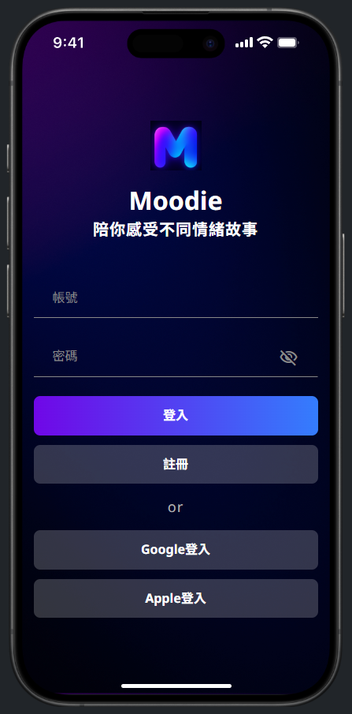
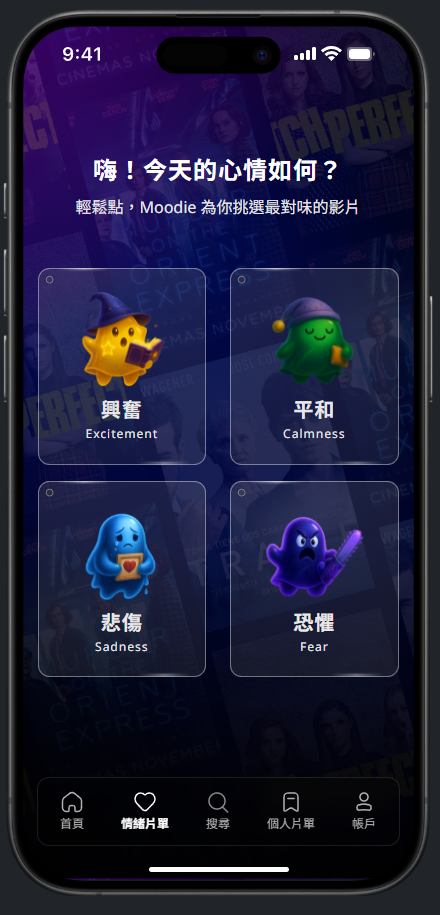

### 2. 選擇情緒後點選前往影片清單，可進入該情緒推薦之相關影片

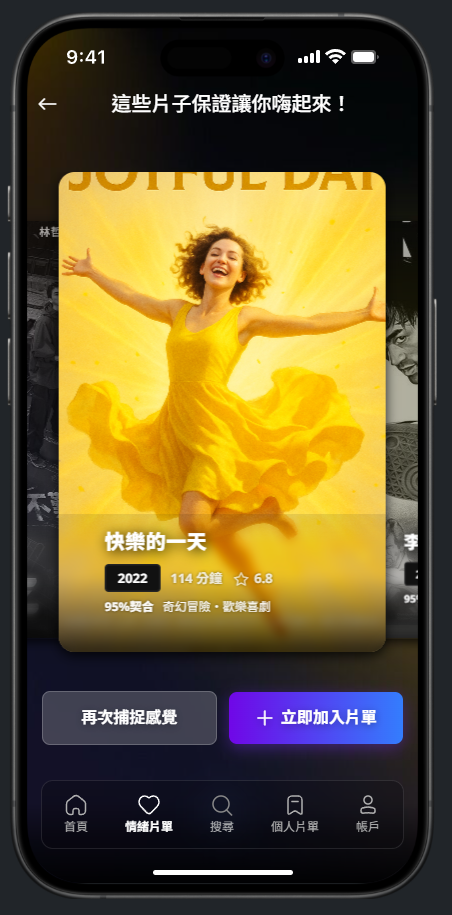

### 3. 點選影片後則可進入影片互動及資訊頁，選擇觀看或是該影片相關資訊內容

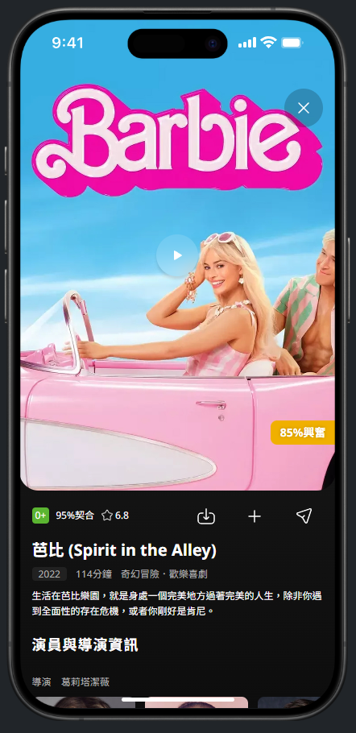
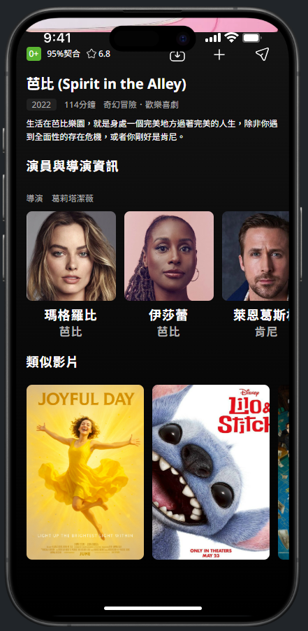

### 4. 點選觀看影片則進入影片播放頁觀賞影片，使用者亦可在此頁面為影片回饋情緒
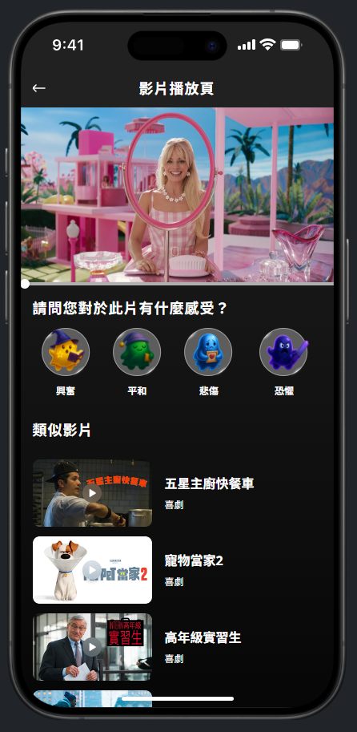

## 其他頁面
### 📱首頁 使用者可在首頁找尋各類影片，並有先前觀看紀錄可繼續觀看
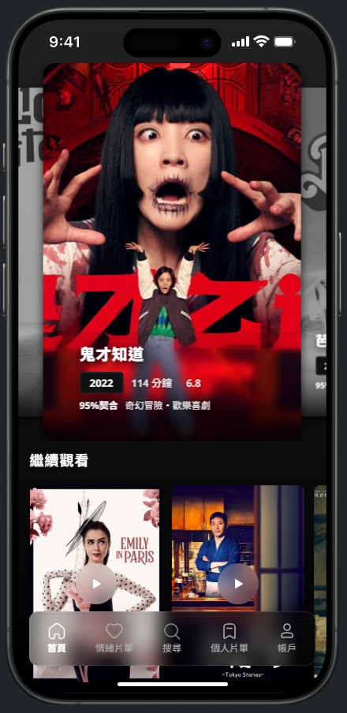

### 📱帳戶頁 使用者可於帳戶頁觀看自己的統計紀錄，以及其他設定等項目
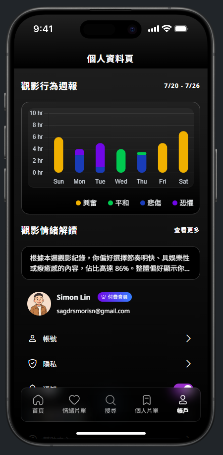

### 📱搜尋頁 使用者可於此頁面觀看當前熱門搜尋影片，亦可找尋欲觀看之影片
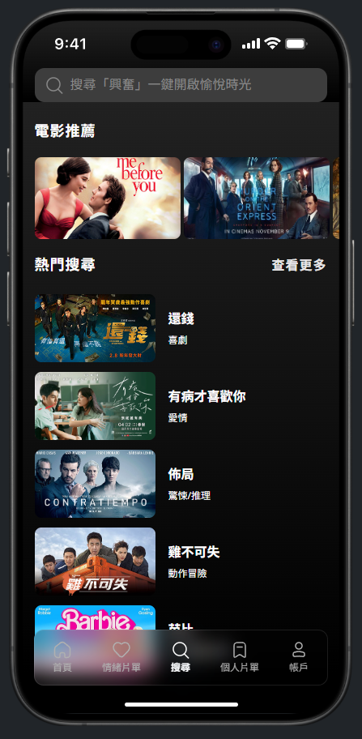

### 📱個人片單頁 此頁面為使用者有加入片單之頁面，可查找過去曾加入的影片清單
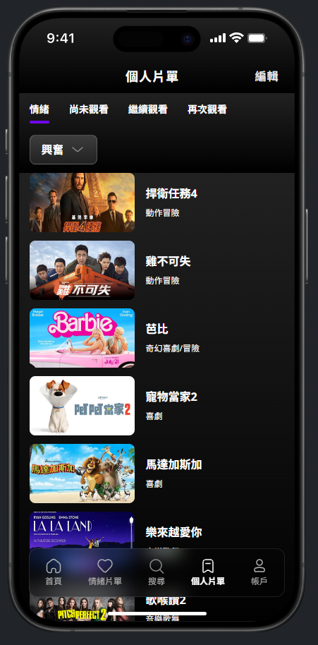

### 📱影片互動與資訊頁 經由不同的情緒選擇可進入到該情緒之影片互動與資訊頁面
### 興奮

### 平和

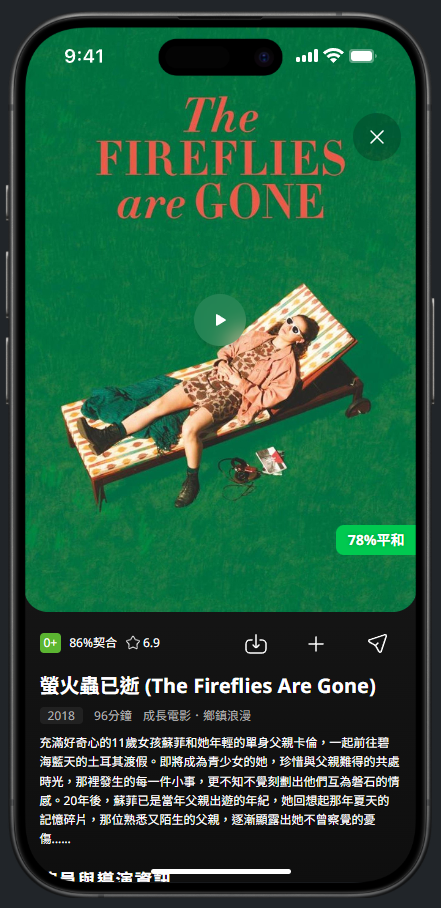
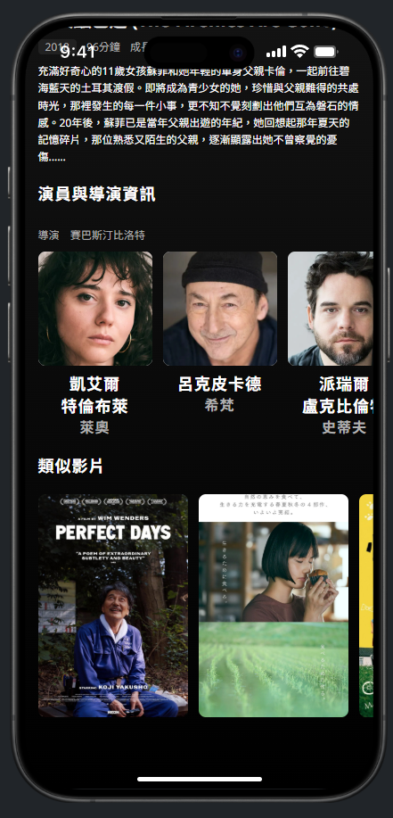

### 悲傷

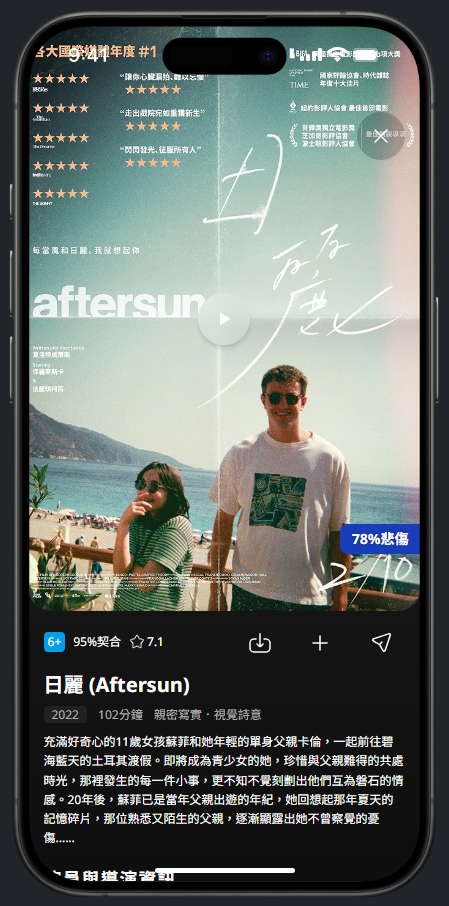

### 恐懼

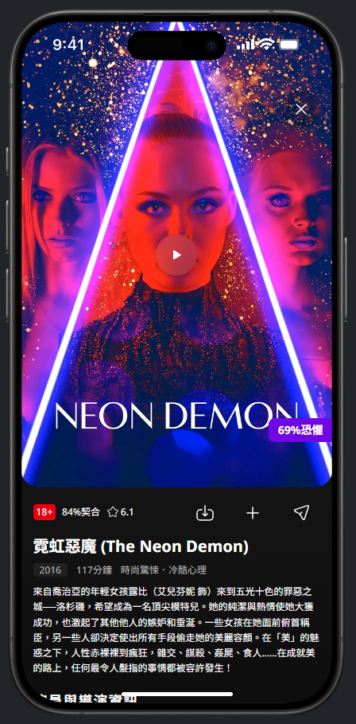
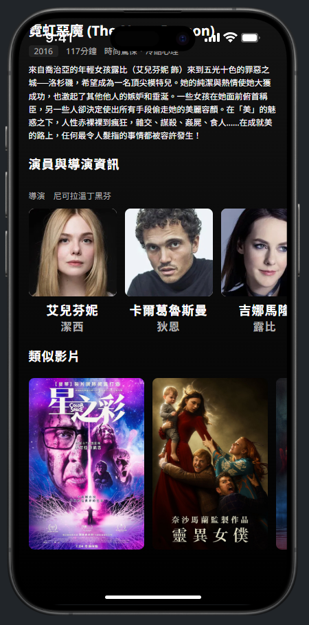

